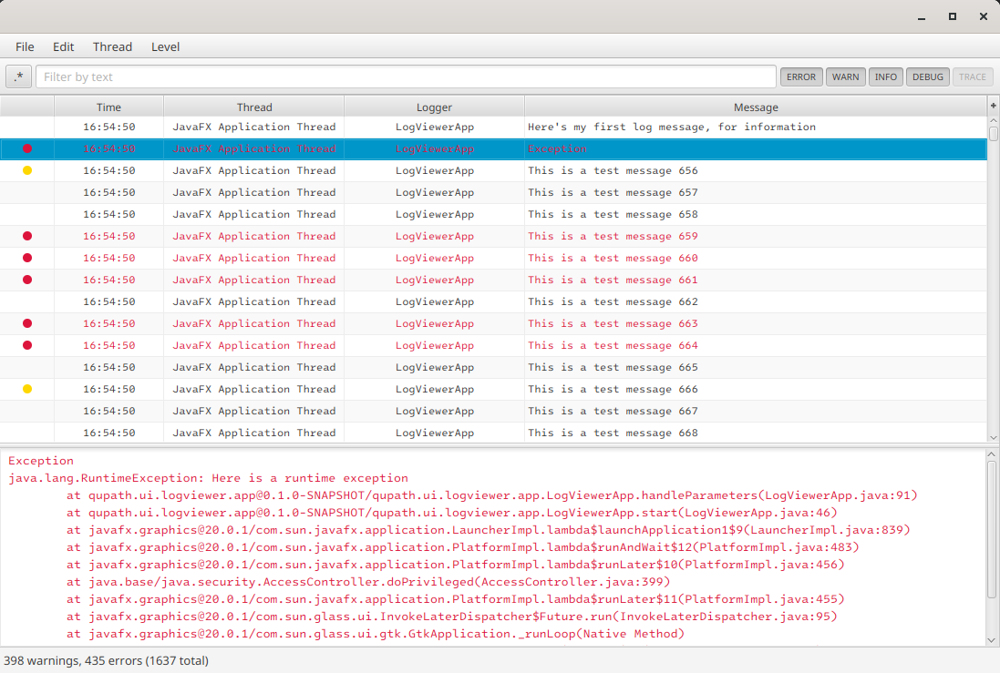

# Log Viewer

<p align="center">

</p>

A simple JavaFX log viewer that can be integrated to any Java application (it is currently used by the [QuPath](https://qupath.github.io/) software) and that displays live logs generated using the [SLF4J API](https://www.slf4j.org/).

The project contains three UI implementations:
* An advanced user interface (`logviewer-ui-main`) where logs are displayed using a TableView and can be filtered by level, message, and thread. It is also possible to set the minimum log level. A text area at the bottom of the application provides more details about a log.
* A simple text area (`logviewer-ui-textarea`) where logs are displayed on a console-like interface.
* A rich text area (`logviewer-ui-richtextfx`) which adds coloring support.

Three logging frameworks are currently supported: the [JavaTM 2 platform's core logging facilities](https://docs.oracle.com/javase/8/docs/api/java/util/logging/package-summary.html), [Logback](https://logback.qos.ch/), and [reload4j](https://reload4j.qos.ch/).

## Installing
The repository contains eight subprojects:
* Three subprojects containing UI implementations, as described above.
* Three subprojects adding support for the Java (`logviewer-logging-jdk`), Logback (`logviewer-logging-logback`), and reload4j (`logviewer-logging-reload4j`) logging frameworks.
* One subproject (`logviewer-api`) used internally to link a UI implementation to a logging framework.
* One subproject (`logviewer-app`) to start one of the UI implementation as a standalone application. It is mainly used for development.

To use the log viewer, choose one of the UI implementation, one of the logging framework, and install them:
```groovy
//build.gradle

// Choose one of those UI implementation:
implementation "io.github.qupath:logviewer-ui-main:0.1.0"
implementation "io.github.qupath:logviewer-ui-textarea:0.1.0"
implementation "io.github.qupath:logviewer-ui-richtextfx:0.1.0"

// Choose one of those logging framework:
implementation "io.github.qupath:logviewer-logging-jdk:0.1.0"
implementation "io.github.qupath:logviewer-logging-logback:0.1.0"
implementation "io.github.qupath:logviewer-logging-reload4j:0.1.0"
```

Then, create the chosen UI implementation. Here is an example with `log-viewer`:
```java
public class TestApp extends Application {
    private final static Logger logger = LoggerFactory.getLogger(TestApp.class);
    
    public static void main(String[] args) {
        Application.launch(TestApp.class, args);
    }
    
    @Override
    public void start(Stage primaryStage) throws IOException {
        LogViewer logviewer = new LogViewer();
        Scene scene = new Scene(logviewer, 800, 600);
        primaryStage.setScene(scene);
        primaryStage.show();

        // These messages should appear in the log viewer
        logger.info("Here's my first log message, for information");
        logger.error("Here's an error");
    }
}
```
All messages logged with the SLF4J API will automatically be displayed by the log viewer (if they are not filtered).

Take a look at the code of the `logviewer-app` subproject to see how to use the other UI implementations.

## Building
You can build every module of the log viewer from source with:
```shell
./gradlew clean build
```
The outputs will be under each subproject's `build/libs`.

## Developing
The easiest way to develop the application is to use the `logviewer-app` subproject.
It starts an application that uses one of the UI implementation depending on the provided arguments:
* `--app=<app>` specifies which UI implementation to use. `<app>` can be one of:
  * `main` (selected by default) for `log-viewer-ui-main`.
  * `textarea` for `log-viewer-ui-textarea`.
  * `richtextfx` for `log-viewer-ui-richtextfx`.
* `-t` indicates whether to log random messages.

Here are two example:
```shell
./gradlew logviewer-app:run --args="--app=main"          // starts the log viewer. No logs are generated
./gradlew logviewer-app:run --args="--app=richtextfx -t" // starts the richtextfx implementation and log random messages
```

If you want to add a new UI implementation:
* Create a dependency on `logviewer-api`.
* Create a class that implements the `LoggerListener` interface of the `logviewer-api` project and make it listen to log messages:
```java
public class UiImplementation implements LoggerListener {
    public UiImplementation() {
        Optional<LoggerManager> loggerManagerOptional = getCurrentLoggerManager();
        if (loggerManagerOptional.isPresent()) {
            loggerManagerOptional.get().addListener(this);
        } else {
            throw new RuntimeException("No logging manager found");
        }
    }

    @Override
    public void addLogMessage(LogMessage logMessage) {
        // This method will be called each time a message is logged
    }
}
```

If you want to add a new logging framework:
* Create a dependency on `logviewer-api`.
* Create a class that implements the `LoggerManager` interface of the `logviewer-api` project and override the required methods.
